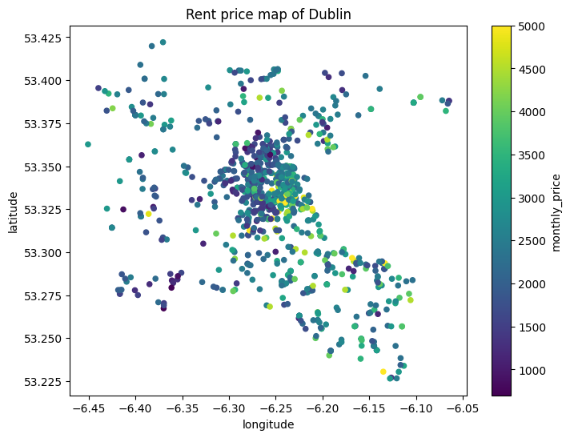
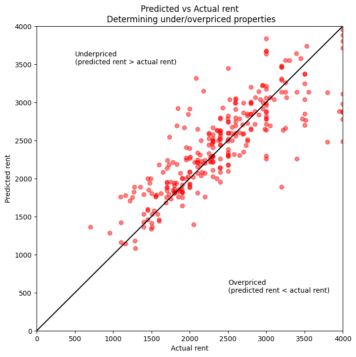

# Dublin Rent Estimator

This model can be used to estimate the monthly rent price of a property in Dublin City, Ireland.

### Data

The model is trained on data from [Daft.ie](https://www.daft.ie/property-for-rent/dublin-city) rent listings (only Dublin City).

### Training

The model is trained using XGBoost. The training data is split into 70% training and 30% testing data.

### Features

| Feature      | Description                            | Importance |
| ------------ | -------------------------------------- | ---------- |
| bathrooms    | Number of bathrooms                    | 0.3836672  |
| bedrooms     | Number of bedrooms                     | 0.32343665 |
| is_apartment | Is the property an apartment?          | 0.15256576 |
| longitude    | Longitude of the property              | 0.07208117 |
| latitude     | Latitude of the property               | 0.04114705 |
| ber          | Building Energy Rating of the property | 0.02710224 |

### Score

The model can predict the rent price of a property with a mean absolute error of €324.70. The mean absolute error is calculated on the testing data.

## Mispriced properties

